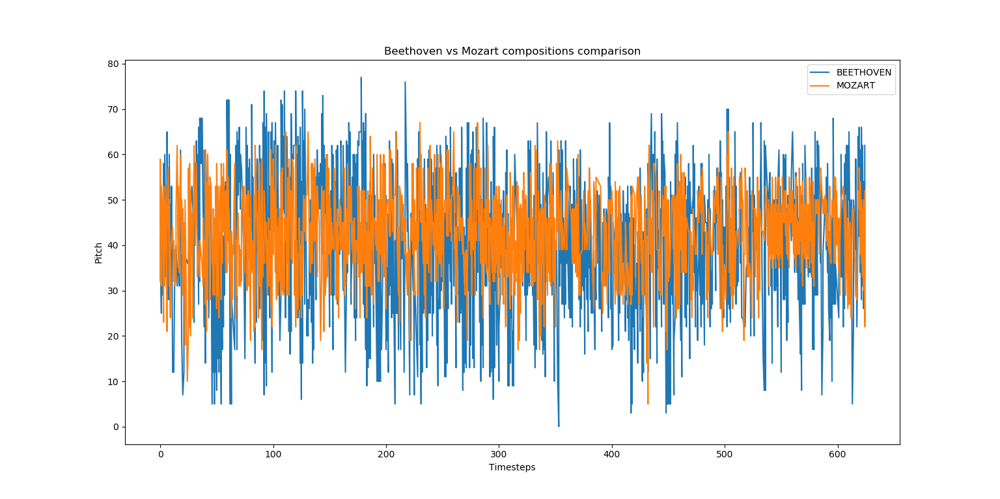
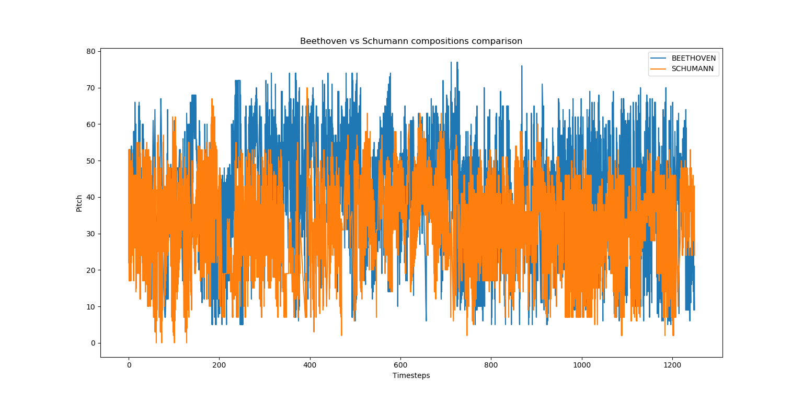
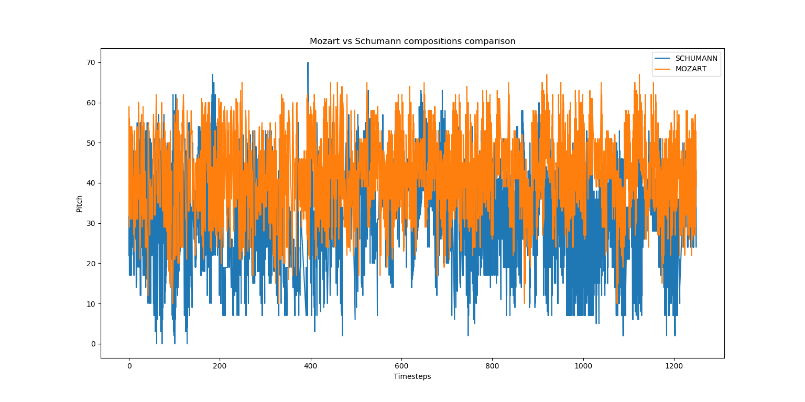

#
Whos-the-composer
A Recurrent Neural Network Classifier to predict the composer of a classical piece

This work was done to explore the uniqueness of classical composers. 
* Do composers have their own unique styles of playing music?
* Can we predict the composer by just listening to the classical piece?

This work builds a Gated Recurrent Network classifier that takes in a segment of a classical piece and predicts its composer.
A decent accuracy of the classifier would indicate that there could be some distinctive quality in the compositions of different composers.

### Dataset
The dataset comprises of midi files from five classical composers (Chopin, Beethoven, Mozart, Schubert, Schumann). 
The midi files were downloaded from the link: http://www.piano-midi.de/

### Preprocessing 
Each midi file is taken and converted to a numpy array of shape (T, 78) where T denotes the timesteps. Each timestep has a granularity of sixteenth note.
Each of the 78 dimensions correspond to a single note on a piano having a binary value (1 or 0). The binary value implies if the note is on or off at each timestep.

### Model Architecture

The state input is encoded through a Gated Recurrent Unit which is further connected to a fully connected layer followed by the output layer for prediction.
We use Adam as the optimizer with an initial learning rate of 1e-4 to minimize our crossentropy loss function.

**State Input --> GRU --> FC_1 --> Output_layer**

State Input shape: (batch_size, timesteps, input_dims)

### Preliminary Data Analysis
Preliminary data visualization shows that:
* Beethoven has the maximum variation in the pitch. 
* Mozart tends to stay in medium pitch. Does not use low pitch very often
* Schumann tends to stay in low pitch. The compositions do not go into high pitch often.

### References

* https://github.com/hexahedria/biaxial-rnn-music-composition  
* http://www.piano-midi.de/

### Requirements

* python3-midi (https://github.com/louisabraham/python3-midi)
* keras
* numpy
